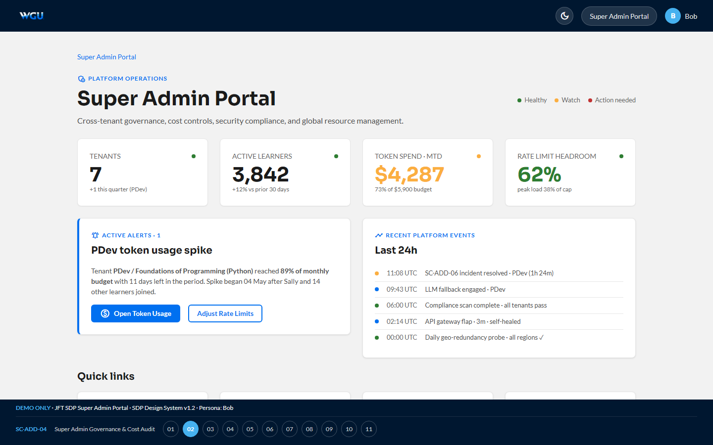

# Super Admin — Bob · v1.3 (extended in storyboard v4.4)

[← Back to root README](../README.md) · [Live portal](https://brady-wgu.github.io/JFT_SDP/super_admin/) · [Catalog](../presentation.html#sc-add-04)

## Persona

**Bob** — WGU platform operations and infrastructure. Authenticates via his own secret LRPS deep link **plus MFA**. Cross-tenant scope: he sees every tenant on the platform and can act on global resource limits.

## Scope

Cross-tenant governance, financial controls, security compliance, global resource management. Bob's responsibilities span billing/cost (token usage, rate limits), security/compliance (TLS 1.3, FERPA), and operational resilience (geo-redundancy, audit log).

## Scenarios

| ID | Description | Screens |
|:---|:------------|:-------:|
| **SC-ADD-04** | **Super Admin Governance & Cost Audit.** LRPS landing → SSO + MFA → portal home (4 KPI gauges + active alerts + recent platform events; **v4.4: 8 quick-link cards** including the new Integrations / Learner Remediation / Billing entries) → Token Usage Tracking (per-tenant breakdown with utilization meters; PDev flagged with spike) → cost-spike drill-down (30-bar daily cost chart, top consuming subjects, "likely cause" diagnosis) → Global Rate Limits config (form + before/after projection + pending audit-trail entry preview) → **Compliance Report — TLS 1.3 + FERPA** (encryption audit §10.7 across 17 services + FERPA privacy audit §10.1 with 4 KPI gauges and a 6-row FERPA control table referencing 34 CFR §§99.10 / 99.31 / 99.32 / 99.37 plus WGU policies 8.2 and 8.4) → Geo-redundancy (3 region cards with replication lag, recent failover tests, RTO under 4-hr target) → cross-tenant audit log feed → **v4.4 G8: Third-Party Integrations** (read-only deep-links to OpenRouter.ai LLM gateway, AWS, Datadog, Entra ID, GitHub, Slack — JFT manages credentials per SOW) → **v4.4 G1: Learner Remediation** (cross-tenant per-learner search; per-objective score reset + force re-diagnostic + reset all progress + pause access; required-justification audit log; cross-tenant scope, global-admin only) → **v4.4 G5: Billing & Cost Centers** (per-tenant cost cards aligned to §11.1, MTD spend + EOM forecast + budget caps; per-model OpenRouter spend split; configurable budget alerts). | 11 |

**Total: 1 scenario · 11 screens.** (v4.4 added 9 / 10 / 11; portal home (screen 2) gained a second row of quick-link cards.)

## Source

JFT SDP User Scenario Catalog: Additional Scenarios **v1.3** (05 May 2026). Authored by Brady Redfearn, WGU Program Development.

## SOW references

§2.4 (AI Orchestration / multi-provider), §2.5 (System health, audit logs), §6.4 (Rate Limiting), §6.6 (Token Tracking), §9.5 (Geo-redundancy / SLA), §9.13 (Monitoring & alerting), §10.1 (FERPA), §10.4 (Audit Logging), §10.7 (Encryption), §11.1 (Hosting + Support fee schedule).

## Files

- [`index.html`](index.html) — interactive storyboard (11 screens)
- `screenshots/` — 11 light-theme PNGs at 1440×900
- `screenshots_dark/` — 11 dark-theme PNGs

## Components introduced in this portal

- **`.spike-card`** + **`.spike-chart`** — 30-bar CSS daily cost trend (no SVG; just `
` bars with height % styling). Last days of the spike are highlighted via `.spike` and `.spike.danger` classes.
- **`.util-meter`** — inline mini-bar with right-aligned numeric value (used in the per-tenant token-usage table)
- **`.region-card`** — region card with side-stripe color (success / warning / danger), region name + location, and stat-row table
- **`.gauge-card`** with `.center` variant — KPI gauges (numeric + label + thin progress bar + target sub-text)
- **`.gauge-number`** color variants (`good`, `warning`, `danger`)
- Pending-audit-trail preview panel on the Rate Limits screen — shows the audit log entry that will be written when "Apply" is clicked

## Notes

- The portal models a privileged session: the SSO landing on screen 1 includes an MFA verification step + a "Privileged session" warning that all actions are logged to the cross-tenant audit trail.
- Cost spike workflow on screens 3-5 is end-to-end: identify the high-consumption tenant (PDev) → drill down to see the 30-day trend with last 4 days as a visible spike → adjust rate limits → see the projected effect (MTD spend back inside budget) → "Apply" writes an audit log entry.
- The Compliance Report on screen 6 covers both encryption (§10.7) and FERPA (§10.1) — TLS 1.3 verification across 17 services plus FERPA privacy controls including staff training, audit retention, data deletion thresholds, and explicit FERPA control mapping to 34 CFR sections.
- The cross-tenant audit log on screen 8 deliberately includes events from all the other v1.3 personas (Alice, Charlie, JFT CSM, system) so you can see how cross-tenant operations are surfaced to the Super Admin role.
